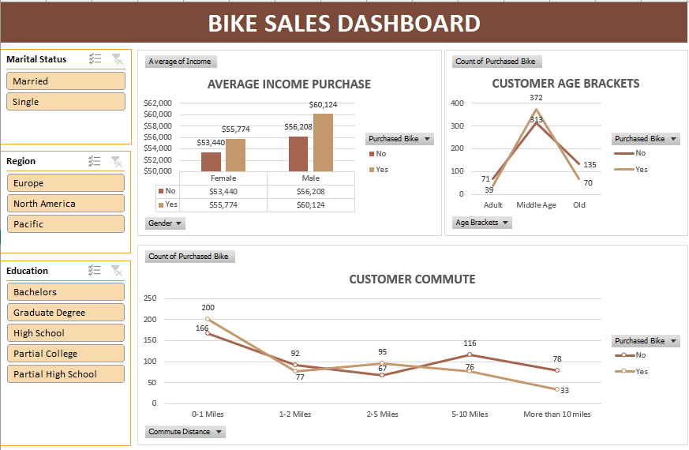

This repository is part of a sales analytics project.
Related dashboard:
- Supermarket Sales Dashboard: https://github.com/username/xxx

# Bike Sales Dashboard (Excel)

## Description
This project analyzes bike sales data sourced from Kaggle to identify customer demographics and purchasing behavior. An interactive Excel dashboard was built to support data-driven insights for sales and marketing decisions.

## Dataset
- Source: Kaggle
- Records: ~1,000 rows
- Data includes customer demographics, income, commute distance, education level, marital status, and region.

## Dashboard Features
- Pivot table analysis of:
  - Average income per purchase
  - Customer age brackets
  - Commute distance
  - Education level
  - Marital status
  - Region
- Interactive slicers for dynamic filtering

## Tools & Techniques
- Microsoft Excel
- Pivot Tables
- Data cleaning and transformation
- Interactive dashboard design

## Preview

